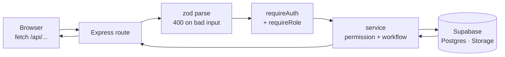

# API documentation

> **Frozen Phase 3 submission snapshot.** This content records the submitted
> API write-up and is no longer maintained. Use the maintained
> [API guide](API.md) for current endpoints, integration behavior, setup, and
> database workflow.

Phase 3 deliverable. This page answers five questions about every API KAMOTI
talks to: what it is, who provides it, why it is here, what comes back, and how
it was wired into this particular website.

KAMOTI uses **one API it builds itself** and **three it consumes from other
providers**. The distinction matters when reading the rest of this page: the
first is ours to change, the other three are not.

For local setup, migrations and the full endpoint reference, see the
[API guide](API.md). This page is the write-up; that one is the manual.

---

## 1. API used

| API | Provider | Kind | Authentication |
| :--- | :--- | :--- | :--- |
| **KAMOTI REST API** | Built by the team — Express 5 on Node.js, TypeScript | First-party, internal | Supabase Auth bearer token |
| **Supabase** — Auth, Data API, Storage | Supabase Inc. | Third-party, account required | Publishable key (sign-in) and secret key (server only) |
| **Nominatim reverse geocoding** | OpenStreetMap Foundation | Third-party, public, free | None — governed by a usage policy |
| **OpenStreetMap raster tiles** | OpenStreetMap Foundation | Third-party, public, free | None — attribution required |

The browser only ever talks to two of these directly: the KAMOTI API, and
Nominatim. Supabase is reached **through** the KAMOTI API and never from the
page, because the key that reads protected data must not leave the server.

---

## 2. API purpose

**KAMOTI REST API.** Every piece of application behaviour. A citizen registers,
signs in, files a report with a photo and a map pin, and follows it to repair.
Staff read the queue assigned to them and move reports forward. Administrators
manage accounts and categories, assign staff, and read analytics and activity
logs. The public transparency board is served from here too, without a login.

It exists as a separate layer rather than letting the page query the database
because **permission decisions have to happen somewhere the user cannot edit**.
The browser can be modified by whoever is holding it; the server cannot.

**Supabase.** Three services behind one project. *Auth* owns passwords and
issues the JSON Web Token that proves who a caller is — the application never
stores a password. *PostgreSQL*, reached through Supabase's Data API, holds the
eight application tables. *Storage* holds the report photos as files.

**Nominatim.** Turns the latitude and longitude of a dropped pin into a
readable address. A citizen standing next to a broken drain should not have to
type out where they are, and the crew sent to fix it wants a street name and a
landmark rather than two decimal numbers.

**OpenStreetMap tiles.** The map imagery itself, under every pin.

---

## 3. API endpoints

### The KAMOTI API

Base path `/api`. The full table with permissions is in the
[API guide](API.md#api-endpoints); this is the shape of it.

| Method | Endpoint | Purpose |
| :--- | :--- | :--- |
| `GET` | `/api/health` | Liveness check, no authentication |
| `POST` | `/api/auth/register` | Create an account — always a citizen |
| `POST` | `/api/auth/login` | Exchange email and password for a token |
| `GET` | `/api/auth/me` | The signed-in caller's profile |
| `GET` | `/api/categories` | Infrastructure categories for the report form |
| `GET` `POST` | `/api/reports` | List (scoped by role) and file reports |
| `GET` `PATCH` | `/api/reports/:id` | Read one report; edit while pending |
| `PATCH` | `/api/reports/:id/status` | Move a report one step forward |
| `PATCH` | `/api/reports/:id/assign` | Assign a staff member — admin only |
| `POST` | `/api/reports/:id/photos` | Attach evidence or proof of repair |
| `GET` | `/api/notifications` | The caller's in-app messages |
| `GET` `POST` `PATCH` | `/api/admin/users` | Account management — admin only |
| `GET` | `/api/admin/analytics` | Volume, status mix, resolution time |
| `GET` | **`/api/public/reports`** | **The transparency board — no login** |
| `GET` | `/api/public/stats` | Counts above the board — no login |

`GET /api/public/reports` accepts `q`, `status`, `category_id`, `from`, `to`,
`sort`, `page` and `per_page`.

### Nominatim

One endpoint, called from the browser.

```
GET https://nominatim.openstreetmap.org/reverse
      ?format=jsonv2
      &lat=14.554700
      &lon=121.024400
      &zoom=18
      &addressdetails=1
```

### OpenStreetMap tiles

```
https://{s}.tile.openstreetmap.org/{z}/{x}/{y}.png
```

Requested by Leaflet as the map is panned, not by application code.

---

## 4. Data retrieved

### `GET /api/public/reports` — the board

Every list endpoint returns the same envelope: the rows under a named key, plus
the paging numbers needed to render the pager.

```json
{
  "reports": [
    {
      "id": "8f3b1c22-0a77-4e51-9d2a-71c4e0b93f10",
      "reference_code": "KMT-2026-000042",
      "title": "Pothole on Rizal Street",
      "description": "Deep pothole near the corner, cars swerve around it.",
      "category": "Road",
      "category_id": 1,
      "latitude": 14.554700,
      "longitude": 121.024400,
      "address_text": "Rizal Street, Poblacion, Makati, Metro Manila",
      "status": "in_progress",
      "submitted_at": "2026-09-14T02:15:11.402Z",
      "resolved_at": null,
      "photos": [
        {
          "kind": "initial",
          "storage_path": "8f3b1c22.../initial-4d07.jpg",
          "url": "https://<project>.supabase.co/storage/v1/object/public/report-photos/..."
        }
      ]
    }
  ],
  "page": 1,
  "per_page": 50,
  "total": 47
}
```

| Field | Type | Notes |
| :--- | :--- | :--- |
| `id` | uuid | Primary key |
| `reference_code` | string | `KMT-<year>-<sequence>`, the number a citizen quotes |
| `title`, `description` | string | What was reported |
| `category`, `category_id` | string, number | Name to display, id to filter on |
| `latitude`, `longitude` | number | Where the pin was dropped |
| `address_text` | string \| null | **Supplied by Nominatim**, editable by the reporter |
| `status` | enum | `under_review`, `in_progress` or `resolved` only |
| `submitted_at`, `resolved_at` | ISO 8601 \| null | Timestamps |
| `photos[]` | array | `kind`, `storage_path`, and a built public `url` |
| `page`, `per_page`, `total` | number | Paging; `total` is the count before paging |

**What is deliberately absent:** no `citizen_id`, no name, no email, no contact
number, and no `pending` or `cancelled` report. This endpoint reads a database
view (`public_reports`) that cannot return those columns or rows at all, rather
than a query that filters them out — a filter can be forgotten, a view cannot.

### `POST /api/auth/login`

```json
{
  "user": { "id": "…", "name": "Juan Dela Cruz", "email": "juan@example.com", "role": "citizen" },
  "access_token": "eyJhbGciOi…",
  "refresh_token": "…",
  "expires_at": 1789200000
}
```

`access_token` is what every later request carries.

### Error responses

One shape for every failure, so the frontend has one thing to handle.

```json
{
  "error": "Some fields are invalid. Fix them and try again.",
  "details": [{ "field": "email", "message": "Enter a valid email address." }]
}
```

`400` invalid input · `401` not signed in · `403` signed in but not allowed ·
`404` not found · `500` server fault.

### Nominatim

The response is large; KAMOTI reads exactly one field.

```json
{
  "place_id": 240118512,
  "lat": "14.5547",
  "lon": "121.0244",
  "display_name": "Rizal Street, Poblacion, Makati, Metro Manila, 1210, Philippines",
  "address": { "road": "Rizal Street", "suburb": "Poblacion", "city": "Makati" }
}
```

Only `display_name` is kept, truncated to 255 characters and written into the
address field the citizen can still edit.

---

## 5. Integration details

### How the browser calls the KAMOTI API

Every request in the application goes through one wrapper,
`src/web/lib/api.ts`, so the token header, the query encoding and the error
shape are defined once instead of at each call site.

```ts
const response = await fetch(`/api${path}${toQuery(query)}`, {
  method,
  headers,                       // Authorization: Bearer <token>, when signed in
  body: formData ?? JSON.stringify(body),
  signal,                        // so a superseded request can be abandoned
});
```

Four decisions in that wrapper are worth naming:

- **Relative URLs.** `/api/...` and never `http://localhost:4000/api/...`. In
  development Vite proxies `/api` to Express on port 4000; in production Vercel
  rewrites the same path to the Node function. The same build works in both
  because it never learns where the API is.
- **The token is attached, never the password.** It is read from
  `localStorage` per request. A `401` or `403` clears it and ends the session.
- **`FormData` for uploads.** When a photo rides along, `Content-Type` is left
  unset so the browser can write its own multipart boundary.
- **The body is never assumed to be JSON.** A crash or a proxy failure can
  return HTML, so parsing is guarded and falls back to a readable message.

Screens do not call `fetch` themselves. They use `useApi` for reads — which
tracks loading and error state and aborts superseded requests with
`AbortController` — and `useAction` for writes. **No screen reloads the page to
show new data**; the board, the queues and the report tables all re-render from
a fetch.

### How the server handles a request



1. **Validate.** Each route declares a zod schema; `parse()` in
   `src/server/lib/validate.ts` rejects bad input as a `400` listing the exact
   fields, which is what draws the red text under a form control.
2. **Authenticate.** `requireAuth` verifies the Supabase token, loads the
   caller's profile, and rejects a deactivated account.
3. **Authorise.** `requireRole("admin")` gates a route; finer rules
   (`assertCanView`, `assertCanEdit`, `assertCanUpdate`) live in
   `src/server/services/reports.service.ts`.
4. **Query.** Only then does the secret-key Supabase client run.

That order is the whole security model. The API holds a secret key that
bypasses row level security, so **the checks in steps 2 and 3 are what actually
enforce access** — the database is not doing it for us on these paths. Row level
security is still enabled underneath as a second line, and the browser's own
database roles are revoked from every protected table, leaving them only
`categories` and the `public_reports` view.

### How Nominatim was integrated

Implemented in `src/web/lib/leaflet.ts` as `reverseGeocode()`, called from the
report wizard in `src/web/pages/NewReport.tsx`.

The flow: the citizen taps the map → the pin's coordinates change → a debounced
effect calls Nominatim → `display_name` is written into the address field →
the field stays editable, and a hand-typed address is never overwritten by a
later lookup.

Four things the integration has to respect, and how:

| Constraint | How it is handled |
| :--- | :--- |
| Nominatim asks for at most one request per second | The lookup is debounced by 700 ms, so dragging a pin sends one request, not one per pixel |
| The service can be slow, rate-limited or down | Failure is silent and returns `null`; the address field simply stays empty and typeable, so a failed lookup costs the citizen nothing |
| A superseded lookup wastes a request | An `AbortController` cancels the previous call when the pin moves again |
| Tiles require attribution | `TILE_ATTRIBUTION` is rendered on the map and credited again in the board's footer |

This is the only third-party API the browser calls directly, and it is
deliberately non-essential: **every report can be filed without it.** The pin is
the authoritative location; the address is a convenience laid on top.

### Where each piece lives

| Concern | File |
| :--- | :--- |
| Browser HTTP wrapper, token, errors | `src/web/lib/api.ts` |
| Read and write hooks | `src/web/lib/useApi.ts` |
| Nominatim and tile configuration | `src/web/lib/leaflet.ts` |
| Express app and route mounting | `src/server/app.ts` |
| Route handlers | `src/server/routes/*.routes.ts` |
| Report permissions and status flow | `src/server/services/reports.service.ts` |
| Token check and role gates | `src/server/middleware/auth.ts` |
| Input schemas | each route file, parsed by `src/server/lib/validate.ts` |
| Supabase clients | `src/server/config/supabase.ts` |
| Schema, access rules, public view | `supabase/migrations/*.sql` |

### Verifying the integration

```bash
curl http://localhost:4000/api/health
# {"status":"ok"}

curl "http://localhost:4000/api/public/reports?per_page=2"
# {"reports":[…],"page":1,"per_page":2,"total":47}

curl http://localhost:4000/api/reports
# {"error":"Sign in to continue."}   — 401, the role gate working

curl "http://localhost:4000/api/public/reports?status=garbage"
# 400 — zod rejecting an invalid filter
```
