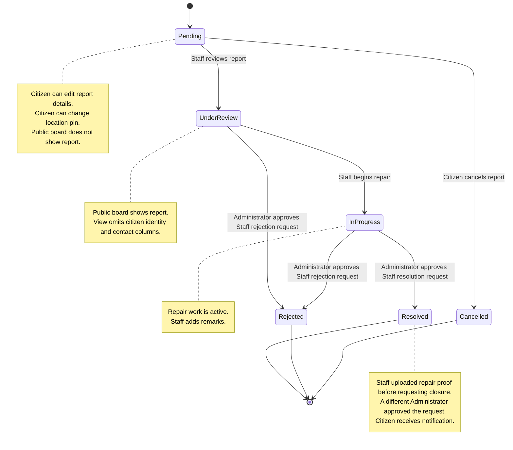
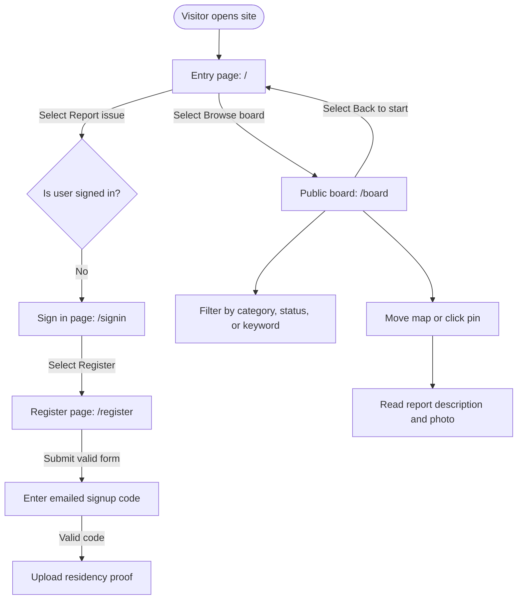
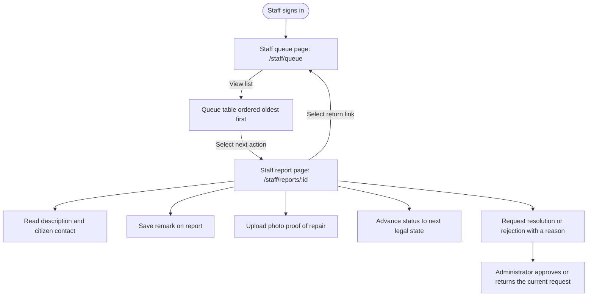
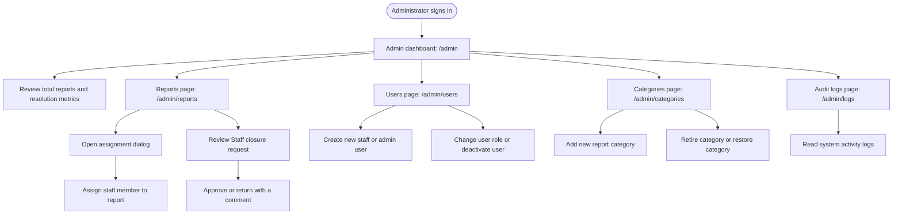

# Developer Journey Maps and System Architecture

## 1. Context and Purpose

### 1.1 System Context
KAMOTI is a web software platform. The platform lets citizens report broken public infrastructure. Examples include damaged roads, broken streetlights, and blocked drainage. The platform lets municipal staff track and repair these problems.

The software stack contains three main parts:
- Frontend: React with TypeScript, Vite, and Tailwind CSS in [`src/web/`](../src/web/).
- Backend: Express API with TypeScript and Node.js in [`src/server/`](../src/server/).
- Database and Auth: Supabase PostgreSQL, Authentication, and Object Storage.

### 1.2 Purpose of this Document
This document defines the complete technical user journeys for all account types.

Developers must use this document to:
- Understand how each user role moves through the system.
- Trace frontend screens to backend API routes and database state changes.
- Explain and demonstrate the system architecture during project reviews.
- Identify system boundaries and verify state changes.

### 1.3 User Roles
The system defines four user roles:
1. Public Visitor: An unauthenticated person who browses published reports.
2. Citizen: A registered resident who submits and tracks personal reports.
3. Staff Member: A municipal field worker who repairs assigned problems.
4. Administrator: A city official who manages reports, accounts, and categories.

---

## 2. Report Lifecycle State Machine

A report has six statuses. [`reports.workflow.ts`](../src/server/services/reports.workflow.ts)
checks legal transitions. Closure request and review use the transaction functions
in the SQL migrations. Assignment alone does not change the status.

### 2.1 State Rules and Permissions

| Report Status | Public Board Visibility | Role That Sets Status | Permitted User Actions |
| :--- | :--- | :--- | :--- |
| `pending` | Hidden | Citizen (on form submit) | The citizen can edit title, description, category, and location pin. The citizen can cancel the report. |
| `under_review` | Visible without citizen identity | Assigned Staff or Administrator, with a comment | Staff or Administrator can record remarks. Administrator can reassign Staff. Assigned Staff can request rejection. |
| `in_progress` | Visible without citizen identity | Assigned Staff or Admin, with a comment | Staff can record remarks. Staff can upload repair photos and request closure. |
| `resolved` | Visible without citizen identity | Administrator approves the current resolution request from a different account | Terminal state. Assigned Staff must upload repair proof before requesting closure. |
| `rejected` | Visible with its reason, without citizen identity | Administrator approves the current rejection request from a different account | Terminal state. The report remains available on the public board. |
| `cancelled` | Hidden | Citizen owner only | Terminal state. System retains database row for audit integrity. |

---

## 3. Persona Journey Maps

### 3.1 Public Visitor Journey

The Public Visitor discovers community problems without an account. The visitor can browse and filter reviewed reports.

#### Step Walkthrough
1. Entry Landing:
   - The visitor lands on [`EntryPage`](../src/web/pages/Entry.tsx) at route `/`.
   - The page requests `/api/public/stats` and shows the total report count.
   - The page shows three descriptive steps of the reporting procedure.
2. Community Transparency Board:
   - The visitor navigates to [`BoardPage`](../src/web/pages/Board.tsx) at route `/board`.
   - The page requests `GET /api/public/reports`.
   - The public view omits citizen identity and contact columns. Report text remains user-entered content.
   - The page stores filter parameters in the browser URL query string.
   - The visitor can pan the map or select report pins to preview details.

---

### 3.2 Citizen Journey

The Citizen registers, submits infrastructure reports through a three-step wizard, and monitors personal report progress.

```mermaid
flowchart TD
    CitizenStart(["Citizen signs in"]) --> Home["My reports page: /my-reports"]
    
    Home -->|"Select Report issue"| Step1["Step 1: Select location on map"]
    Step1 -->|"Select location"| ReverseGeo["System fills address text"]
    ReverseGeo --> Step2["Step 2: Enter category, title, description"]
    Step2 --> Step3["Step 3: Upload photo and check summary"]
    Step3 -->|"Submit report"| DetailView["Report detail page: /reports/:id"]
    
    Home -->|"Search or filter"| ReportTable["Reports table"]
    ReportTable -->|"Pending report"| CancelAction["Cancel report action"]
    ReportTable -->|"Select row"| DetailView
    
    DetailView -->|"If status is Pending"| EditMode["Edit report page"]
    EditMode -->|"Save changes"| DetailView
    DetailView --> ReadTimeline["Read history updates and photo proof"]
    
    Home -->|"Select Notifications"| NotifView["Notifications page: /notifications"]
    NotifView -->|"Select Open report"| DetailView
```

#### Step Walkthrough
1. Authentication:
   - The user opens [`RegisterPage`](../src/web/pages/Register.tsx) at `/register`.
   - The user enters name parts, email, password, barangay, address, privacy consent, and optional contact number.
   - Public registration always assigns the `citizen` role.
   - A six-digit signup code confirms the email and signs the user in. An unconfirmed account cannot sign in with its password.
   - The user uploads residency proof at `/register?step=proof`. Uploading unlocks reporting during Administrator review; rejection locks it again.
   - Later sign-in and password recovery use [`SignInPage`](../src/web/pages/SignIn.tsx). Recovery requires an emailed recovery code, then ends old sessions.
2. Report Submission Wizard:
   - The citizen opens [`NewReportPage`](../src/web/pages/NewReport.tsx) at `/report/new`.
   - Step 1 (Where is it?): The user chooses a Google Maps pin or a Places result inside Makati on [`MapPicker.tsx`](../src/web/components/MapPicker.tsx). Nominatim reverse-geocodes the coordinates into an editable address. The API separately rejects outside pins.
   - Step 2 (What is wrong?): The user enters a title (3 to 150 characters), category, main problem, optional second problem, and description (10 to 1000 characters).
   - Step 3 (Show us): The user attaches an optional photo (max 3 MB, JPG/PNG/WebP). The user reviews the summary and clicks submit.
3. Personal Workspace and Report Tracking:
   - The citizen opens [`MyReportsPage`](../src/web/pages/MyReports.tsx) at `/my-reports`.
   - If the report status is `pending`, the citizen can cancel the report.
   - The citizen opens [`ReportDetailPage`](../src/web/pages/ReportDetail.tsx) at `/reports/:id`.
   - While the report status is `pending`, the citizen can edit details inline.
   - The citizen monitors status updates on the chronological timeline.
   - Once a report is resolved, its reporting Citizen can submit one feedback rating. Other Citizens and unresolved reports are refused.
   - An unsent report draft stays in this tab, under the Citizen's account identifier. After an idle sign-out, the same Citizen can sign in and choose Restore draft. Attached files must be selected again.

---

### 3.3 Staff Member Journey

The Staff Member inspects assigned reports, communicates with citizens, records operational notes, uploads repair proof, and advances report status.

#### Step Walkthrough
1. Queue Triage:
   - The staff member signs in and lands on [`StaffQueuePage`](../src/web/pages/StaffQueue.tsx) at `/staff/queue`.
   - The API scopes `GET /api/reports` to reports assigned to this staff member.
   - The table sorts items oldest first.
   - Each row displays the relevant next action. A closure request waits for Administrator review without changing its current status.
2. Report Execution:
   - The staff member opens [`StaffReportPage`](../src/web/pages/StaffReport.tsx) at `/staff/reports/:id`.
   - The staff member reads citizen contact information for field communication.
   - The staff member can add an operational remark via `POST /api/reports/:id/remarks`.
   - The staff member can upload a repair proof photo via `POST /api/reports/:id/photos`.
   - The staff member advances to `under_review` or `in_progress` through `PATCH /api/reports/:id/status`, with a comment.
   - The assigned Staff member requests resolution after uploading repair proof, or requests rejection with a reason. A different Administrator approves the current request or returns it for more work. A replaced or already reviewed request returns 409.

---

### 3.4 Administrator Journey

The Administrator monitors system metrics, triages incoming reports, assigns staff members, provisions accounts, and inspects activity logs.

#### Step Walkthrough
1. Dashboard Analytics:
   - The administrator lands on [`AdminDashboardPage`](../src/web/pages/AdminDashboard.tsx) at `/admin`.
   - The screen shows total reports, resolved count, and average resolution time in days.
   - Proportional bar charts show distribution across statuses and categories.
2. Report Assignment:
   - The administrator opens [`AdminReportsPage`](../src/web/pages/AdminReports.tsx) at `/admin/reports`.
   - The administrator opens the assignment dialog on a report.
   - The administrator selects an active Staff member and submits `PATCH /api/reports/:id/assign` with a comment.
   - The server records the assignment without changing the report status.
   - Administrator closure review sends the displayed request timestamp. Approval requires an account different from the requester, even if the requester has since become an Administrator.
3. User and Category Maintenance:
   - The administrator opens [`AdminUsersPage`](../src/web/pages/AdminUsers.tsx) at `/admin/users` to create staff or admin accounts.
   - The administrator can deactivate users without deleting historical reports.
   - The Administrator reviews residency proof through a short-lived private URL. The API must save a proof-view audit entry before returning that URL. Profile changes and residency review save their audit records with the change.
   - The administrator opens [`AdminCategoriesPage`](../src/web/pages/AdminCategories.tsx) to add or retire categories.
4. Audit Log Review:
   - The administrator opens [`AdminLogsPage`](../src/web/pages/AdminLogs.tsx) at `/admin/logs`.
   - The screen shows system-wide events with actor name, role, timestamp, and JSON metadata.

---

## 4. Verification and Grounding Matrix

This matrix links each journey step to the verified source files in the repository.

| User Flow | Frontend UI File | Backend API Route | Service or DB Operation | Verification Rule |
| :--- | :--- | :--- | :--- | :--- |
| Public Board Browsing | [`Board.tsx`](../src/web/pages/Board.tsx) | `GET /api/public/reports` | [`public.routes.ts`](../src/server/routes/public.routes.ts) | Returns published reports without citizen identity and contact columns. |
| Citizen Submission | [`NewReportPage`](../src/web/pages/NewReport.tsx) | `POST /api/reports` | [`reports.submission.routes.ts`](../src/server/routes/reports.submission.routes.ts) | Validates title, description, category, problem type, and coordinates. Saves optional initial photo. |
| Citizen Report Edit | [`ReportDetailPage`](../src/web/pages/ReportDetail.tsx) | `PATCH /api/reports/:id` | [`reports.submission.routes.ts`](../src/server/routes/reports.submission.routes.ts) | Server accepts edit only if status is `pending` and caller is report owner. |
| Citizen Cancellation | [`MyReportsPage`](../src/web/pages/MyReports.tsx) | `POST /api/reports/:id/cancel` | [`reports.submission.routes.ts`](../src/server/routes/reports.submission.routes.ts) | Updates status to `cancelled`. Does not delete database record. |
| Staff Queue Retrieval | [`StaffQueuePage`](../src/web/pages/StaffQueue.tsx) | `GET /api/reports` | [`reports.routes.ts`](../src/server/routes/reports.routes.ts) | Scopes records to caller staff ID. The queue requests oldest-first ordering. |
| Status Transition | [`StaffReportPage`](../src/web/pages/StaffReport.tsx) | `PATCH /api/reports/:id/status` | [`reports.workflow.ts`](../src/server/services/reports.workflow.ts) | Enforces a legal forward step with a comment. Direct transitions stop at `in_progress`; closure requires review. |
| Closure Review | [`VerificationPanel`](../src/web/components/VerificationPanel.tsx) | `POST /api/reports/:id/closure-review` | [`reports.workflow.ts`](../src/server/services/reports.workflow.ts) and SQL migrations | Binds review to the displayed request timestamp, rejects self-approval, and commits closure/history/audit/notices together. |
| Repair Photo Upload | [`StaffReportPage`](../src/web/pages/StaffReport.tsx) | `POST /api/reports/:id/photos` | [`reports.routes.ts`](../src/server/routes/reports.routes.ts) | Classifies photo kind as `resolution` when uploaded by staff or admin. |
| Staff Assignment | [`AdminReportsPage`](../src/web/pages/AdminReports.tsx) | `PATCH /api/reports/:id/assign` | [`reports.routes.ts`](../src/server/routes/reports.routes.ts) | Requires an active Staff profile and a comment. Assignment preserves the report status. |
| User Provisioning | [`AdminUsersPage`](../src/web/pages/AdminUsers.tsx) | `POST /api/admin/users` | [`src/server/routes/admin.routes.ts`](../src/server/routes/admin.routes.ts) | Admin creates user with staff or admin role and sets initial password. |
| Category Retirement | [`AdminCategoriesPage`](../src/web/pages/AdminCategories.tsx) | `DELETE /api/categories/:id` | [`src/server/routes/categories.routes.ts`](../src/server/routes/categories.routes.ts) | Sets `is_active = false`. Keeps category linked on existing reports. |
