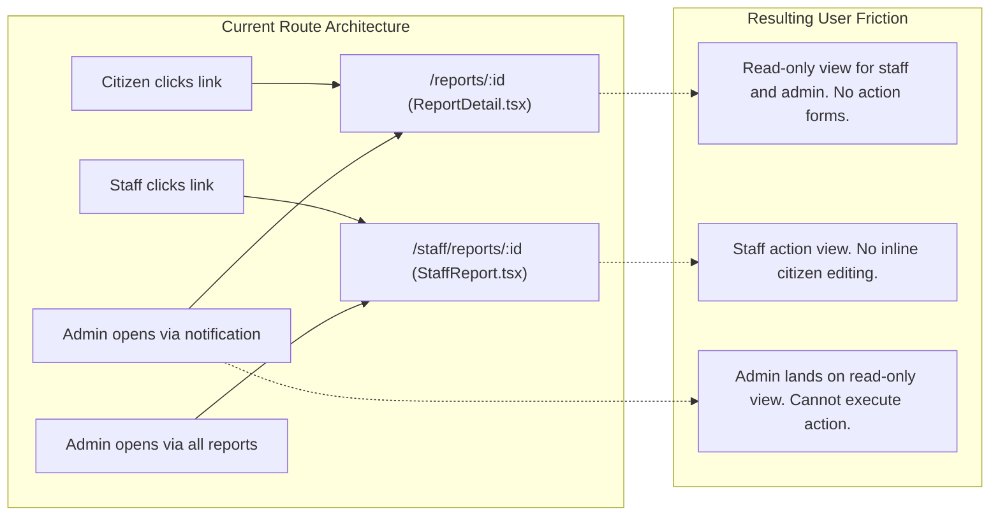

# KAMOTI: UI/UX Route Triage and Optimization Plan

This document defines the user interface and user experience audit for the KAMOTI platform. It integrates empirical route triage findings, identifies operational friction points, and defines a prioritized roadmap to improve system usability.

---

## 1. Context and Purpose

### 1.1 Purpose of this Document
Developers and designers must use this document to:
- Identify high-priority user experience defects across all platform routes.
- Understand the technical and operational risks of unoptimized interfaces.
- Execute interface changes using verified design patterns and controlled technical English.
- Prepare the platform for academic evaluation, project review, and live field use.

### 1.2 Why Optimization is Necessary (Background)
KAMOTI connects citizens, municipal field workers, and administrators in a single civic tracking workflow:
- Citizens file infrastructure issues on mobile devices under outdoor conditions.
- Municipal staff triage and repair reported problems in the field.
- Administrators schedule tasks, assign personnel, and audit system activity.

Initial development established correct database schemas, role validation, and core page components. However, several interfaces contain layout shifts, crowded navigation bars, and incomplete summaries. Interface optimization resolves these friction points before project evaluation.

### 1.3 Consequences of Inaction
If the team does not resolve these interface defects, the following failures will occur:

| Persona / Area | Consequence of Inaction | Net Operational Impact |
| :--- | :--- | :--- |
| **Citizen (Mobile)** | Citizens drop out of the report wizard because Step 3 does not show description or photo previews. Citizens must navigate backward to verify data. | Increased submission errors, duplicate reports, and report abandonment. |
| **Public Visitor (Mobile)** | The 320px static map pushes report cards below the fold on mobile screens. Users cannot see reports without scrolling past the map. | Poor public transparency engagement and degraded first impressions for evaluators. |
| **Staff Member (Field)** | Table rows on mobile force horizontal scrolling. Action buttons labeled "Begin work" navigate to detail pages instead of changing status, causing user confusion. | Slower response times in the field and operational user frustration. |
| **Administrator** | Top navigation bar displays 9 flat items, wrapping into multiple rows on medium displays. Administrators cannot switch sub-modules without returning to the main header. | Degraded visual credibility and navigation inefficiency during system demonstrations. |

---

## 2. Design System Foundation

KAMOTI uses a Modernist design language defined in [`src/web/styles/app.css`](../src/web/styles/app.css) and [`src/web/styles/ds.css`](../src/web/styles/ds.css):
- **Typography:** Heavyweight Archivo headings paired with monospace metadata tags.
- **Zero Radius:** Rectangular borders without rounded corners (`--radius-sm: 0px`, `--radius-md: 0px`, `--radius-lg: 0px`).
- **Industrial Contrast:** Light neutral backgrounds (`#f3f2f2`, `#eae9e9`), dark charcoal text (`#201e1d`), 2px divider lines, and a safety-orange accent (`#ec3013`).

### 2.1 Evaluator Perspective
Evaluators assess four key areas during system demonstration:
1. **Frictionless Reporting:** A resident can submit an issue quickly with minimal cognitive load.
2. **Operational Clarity:** Field workers can identify their next task without navigating nested menus.
3. **Information Hierarchy:** Screens display operational context clearly without raw database clutter.
4. **Mobile Usability:** Screens adapt cleanly to mobile viewports without horizontal table overflow or hidden controls.

---

## 3. Complete Frontend Route Triage Matrix

The platform contains 15 distinct routes across 4 user roles. The table below lists each route, its source component, identified defects, and priority tier.

| Route Path | Primary Role | Source File | UX/UI Friction Points & Evidence | Priority Tier |
| :--- | :--- | :--- | :--- | :--- |
| `/` | Public Visitor | [`EntryPage`](../src/web/pages/Entry.tsx) | Page handles missing statistics gracefully ([`Entry.tsx:L14-16`](../src/web/pages/Entry.tsx#L14-L16)). The bottom board link card lacks strong interactive signposting. | Tier 3 (Low) |
| `/board` | Public Visitor | [`BoardPage`](../src/web/pages/Board.tsx) | **Resolved:** Added mobile segmented toggle (Map View / List View) with `AutoInvalidate` (`map.invalidateSize()`). Report cards render immediately on mobile without scrolling past map. | **Tier 1 (Completed: #34, commit `432e4f0`)** |
| `/signin` | Unauthenticated | [`SignInPage`](../src/web/pages/SignIn.tsx) | Clean single-column layout with client-side validation and focus management ([`SignIn.tsx:L47-63`](../src/web/pages/SignIn.tsx#L47-L63)). | Tier 3 (Low) |
| `/register` | Unauthenticated | [`RegisterPage`](../src/web/pages/Register.tsx) | Standard registration form with contact number formatting ([`Register.tsx:L60-90`](../src/web/pages/Register.tsx#L60-L90)). | Tier 3 (Low) |
| `/report/new` | Citizen | [`NewReportPage`](../src/web/pages/NewReport.tsx) | **Resolved:** Step 3 renders full description text and photo thumbnail preview with file size; added interactive step navigation buttons across all visited steps. | **Tier 1 (Completed: #33, commit `93143ea`)** |
| `/my-reports` | Citizen | [`MyReportsPage`](../src/web/pages/MyReports.tsx) | **Mobile Table Overflow:** Standard table forces horizontal scrolling ([`MyReports.tsx:L126`](../src/web/pages/MyReports.tsx#L126)). **Cancel Flow Expansion:** Inline confirmation expands three controls in a single cell ([`MyReports.tsx:L193-217`](../src/web/pages/MyReports.tsx#L193-L217)). | Tier 2 (Medium) |
| `/reports/:id` | Citizen / All | [`ReportDetailPage`](../src/web/pages/ReportDetail.tsx) | Read-only screen for staff and administrators; does not show operational action forms ([`ReportDetail.tsx:L63-75`](../src/web/pages/ReportDetail.tsx#L63-L75)). Photo evidence lacks full-resolution zoom. | Tier 2 (Medium) |
| `/notifications` | All Roles | [`NotificationsPage`](../src/web/pages/Notifications.tsx) | Unread badge and bulk update work correctly. Routing targets bifurcate based on user role ([`Notifications.tsx:L111-120`](../src/web/pages/Notifications.tsx#L111-L120)). | Tier 3 (Low) |
| `/staff/queue` | Staff Member | [`StaffQueuePage`](../src/web/pages/StaffQueue.tsx) | **Action Affordance Mismatch:** Primary button labeled "Begin work" or "Resolve" ([`StaffQueue.tsx:L127-129`](../src/web/pages/StaffQueue.tsx#L127-L129)) navigates to detail view instead of executing transition. **Mobile Table Scrolling:** Strict table layout is difficult to use on small screens. | Tier 2 (Medium) |
| `/staff/reports/:id`| Staff / Admin | [`StaffReportPage`](../src/web/pages/StaffReport.tsx) | Three stacked forms clutter the right column. Citizen phone number is plain text instead of a clickable link ([`StaffReport.tsx:L88`](../src/web/pages/StaffReport.tsx#L88)). | Tier 2 (Medium) |
| `/admin` | Administrator | [`AdminDashboardPage`](../src/web/pages/AdminDashboard.tsx) | **Resolved:** Clean proportional bar metrics; secondary sub-navigation provided by persistent `AdminLayout` tab bar. | **Tier 1 (Completed: #32, commit `f579ee0`)** |
| `/admin/reports` | Administrator | [`AdminReportsPage`](../src/web/pages/AdminReports.tsx) | **Resolved:** Assignment dialog works as intended; integrated under persistent `AdminLayout` secondary tab bar. | **Tier 1 (Completed: #32, commit `f579ee0`)** |
| `/admin/users` | Administrator | [`AdminUsersPage`](../src/web/pages/AdminUsers.tsx) | **Resolved:** User creation and role modification work as expected; integrated under persistent `AdminLayout` secondary tab bar. | **Tier 1 (Completed: #32, commit `f579ee0`)** |
| `/admin/categories`| Administrator | [`AdminCategoriesPage`](../src/web/pages/AdminCategories.tsx) | **Resolved:** Category retirement functions correctly; integrated under persistent `AdminLayout` secondary tab bar. | **Tier 1 (Completed: #32, commit `f579ee0`)** |
| `/admin/logs` | Administrator | [`AdminLogsPage`](../src/web/pages/AdminLogs.tsx) | System audit log viewer. Table forces horizontal scrolling on mobile viewports ([`AdminLogs.tsx:L34`](../src/web/pages/AdminLogs.tsx#L34)). Integrated under `AdminLayout`. | Tier 2 (Medium) |
| **Global Shell** | All Roles | [`Layout.tsx`](../src/web/components/Layout.tsx) | **Resolved:** Consolidated 5 flat admin links in the global header into a single `Admin` nav link, eliminating link wrapping on tablet and desktop viewports. | **Tier 1 (Completed: #32, commit `f579ee0`)** |

---

## 4. Deep-Dive Journey Findings

### 4.1 Public Transparency Board ([`Board.tsx`](../src/web/pages/Board.tsx))
- **The Mobile Map Trap:** On viewports under 1024px, the map occupies a fixed height of 320px (`h-[320px]`). On a 375x812 display, the top navigation, search filters, and map consume more than 650px. The visitor must scroll through multiple screen lengths before seeing a single report card.
- **Card Expansion Layout Shifts:** In [`Board.tsx:L330-360`](../src/web/pages/Board.tsx#L330-L360), clicking an unselected card dynamically renders its description, address, and photo frame inside the list. This expansion causes a 200px to 300px height jump, displacing adjacent cards and shifting scroll position.

### 4.2 Citizen Report Submission Wizard ([`NewReport.tsx`](../src/web/pages/NewReport.tsx))
- **Pre-Flight Summary Incompleteness:** Step 3 (`Check before sending`, [`NewReport.tsx:L309-318`](../src/web/pages/NewReport.tsx#L309-L318)) summarizes only Category, Title, and Location. It omits the description text and photo thumbnail. Citizens cannot verify what they typed or attached without clicking the Back button multiple times.
- **Linear Step Isolation:** Step navigation is strictly sequential. Users cannot select step headers directly to correct previously entered values.

### 4.3 Administrator Sub-System Fragmentation ([`Layout.tsx`](../src/web/components/Layout.tsx) & Admin Routes)
- **Top Header Bloat:** The global header renders flat links for all admin pages (`Dashboard`, `Reports`, `Users`, `Categories`, `Activity`), along with `Community board`, `Notifications`, and user credentials. On tablet screens (768px to 1024px), these links wrap into multiple lines.
- **Sub-Navigation Absence:** Navigating to `/admin/categories` leaves no contextual breadcrumbs or tabs. To access `/admin/reports`, the administrator must reach back up to the primary header.

### 4.4 Field Staff Operations ([`StaffQueue.tsx`](../src/web/pages/StaffQueue.tsx))
- **Action Affordance Confusion:** Table rows display a primary action button labeled with the next transition (such as "Begin work" or "Resolve", [`StaffQueue.tsx:L127-129`](../src/web/pages/StaffQueue.tsx#L127-L129)). Clicking this button navigates to `/staff/reports/:id` rather than updating the status. This creates a cognitive mismatch for field staff.
- **Mobile Table Formatting:** Data rows force horizontal scrolling on small devices, complicating one-hand operation on physical work sites.

### 4.5 The Dual Report Detail Disconnect
The application maintains two separate detail screens for the same underlying report:
- [`ReportDetail.tsx`](../src/web/pages/ReportDetail.tsx) (`/reports/:id`): Citizen view with timeline and inline edit mode.
- [`StaffReport.tsx`](../src/web/pages/StaffReport.tsx) (`/staff/reports/:id`): Staff view with stacked action forms and reporter contact information.

---

## 5. Implementation Exemplars and Anti-Patterns

| Operational Area | Anti-Pattern in Codebase | Recommended Exemplar Implementation |
| :--- | :--- | :--- |
| **Mobile Map/List Balance** | Stacking a 320px static map above the card list on mobile ([`Board.tsx:L252`](../src/web/pages/Board.tsx#L252)), hiding cards below the fold. | Use the design system segmented control (`.seg` and `.seg-opt`, [`ds.css:L111-123`](../src/web/styles/ds.css#L111-L123)) on mobile to switch between `Map View` and `List View`. |
| **Admin Navigation** | Rendering 5 separate administrative route links directly in the global header ([`Layout.tsx:L23-30`](../src/web/components/Layout.tsx#L23-L30)). | Render a single `Admin` link in the global header. Render an internal secondary tab bar (`Analytics`, `Reports`, `Users`, `Categories`, `Audit`) across all `/admin/*` pages. |
| **Pre-Flight Summary** | Summarizing only 3 fields and omitting description and photo attachments ([`NewReport.tsx:L309-318`](../src/web/pages/NewReport.tsx#L309-L318)). | Render a complete pre-flight review card with category, title, coordinates, formatted address, description text, and a photo thumbnail preview. |
| **Staff Work Queue Action** | Styling navigation links as primary state-change action buttons ([`StaffQueue.tsx:L127`](../src/web/pages/StaffQueue.tsx#L127)). | Label the button `Open report` or render a secondary inspect link, reserving primary state-change buttons for the actual execution page. |

---

## 6. Prioritized Execution Roadmap

### Tier 1: High-ROI, Zero-Backend-Risk Improvements (Completed)
*Focus: Resolves header crowding, completes citizen verification, and eliminates mobile map traps.*

1. **[x] Admin Navigation Consolidation:**
   - Consolidated [`Layout.tsx`](../src/web/components/Layout.tsx) admin links into a single `Admin` link.
   - Built reusable [`AdminLayout.tsx`](../src/web/components/AdminLayout.tsx) secondary tab bar across `/admin`, `/admin/reports`, `/admin/users`, `/admin/categories`, and `/admin/logs`.
   - **Resolution:** Issue [#32](https://github.com/10Plaiz/its122p-NO/issues/32), Commit `f579ee0`. Verified by Playwright test `UIUX-01` in [`admin.browser.ts`](../tests/browser/admin.browser.ts).
2. **[x] Citizen Wizard Pre-Flight Completion:**
   - Updated [`NewReport.tsx`](../src/web/pages/NewReport.tsx) Step 3 to render full description text and photo attachment thumbnail preview with file size.
   - Added interactive step navigation buttons across all visited steps with `maxStep` tracking.
   - **Resolution:** Issue [#33](https://github.com/10Plaiz/its122p-NO/issues/33), Commit `93143ea`. Verified by Playwright test `UIUX-02` in [`citizen.browser.ts`](../tests/browser/citizen.browser.ts).
3. **[x] Public Board Mobile Segmented View:**
   - In [`Board.tsx`](../src/web/pages/Board.tsx), introduced a mobile segmented toggle (`List View` vs `Map View`) using `.seg` and `.seg-opt` classes.
   - Updated [`ReportMap.tsx`](../src/web/components/ReportMap.tsx) with `AutoInvalidate` (`map.invalidateSize()` and `ResizeObserver`) to prevent unrendered tile boxes upon selection.
   - **Resolution:** Issue [#34](https://github.com/10Plaiz/its122p-NO/issues/34), Commit `432e4f0`. Verified by Playwright test `UIUX-03` in [`responsive.browser.ts`](../tests/browser/responsive.browser.ts).

#### Verification Evidence Artifacts (Tier 1)

| Feature Slice | Issue | Visual Evidence | Verification Test | Result |
| :--- | :--- | :--- | :--- | :--- |
| **Admin Navigation Header & Tabs** | [#32](https://github.com/10Plaiz/its122p-NO/issues/32) | [`ADMIN-header-desktop.png`](../tests/evidence/ADMIN-header-desktop.png) [`ADMIN-header-tablet.png`](../tests/evidence/ADMIN-header-tablet.png) | `tests/browser/admin.browser.ts:UIUX-01` | Passed |
| **Citizen Wizard Step 3 Review** | [#33](https://github.com/10Plaiz/its122p-NO/issues/33) | [`CITIZEN-wizard-step3-summary.png`](../tests/evidence/CITIZEN-wizard-step3-summary.png) | `tests/browser/citizen.browser.ts:UIUX-02` | Passed |
| **Mobile Board Segmented Toggle** | [#34](https://github.com/10Plaiz/its122p-NO/issues/34) | [`BOARD-mobile-list.png`](../tests/evidence/BOARD-mobile-list.png) [`BOARD-mobile-map.png`](../tests/evidence/BOARD-mobile-map.png) | `tests/browser/responsive.browser.ts:UIUX-03` | Passed |

### Tier 2: Responsive Ergonomics and Field Usability
*Focus: Improves touch targets and mobile field workflows for staff and citizens.*

1. **Staff Work Queue Responsiveness:**
   - Replace table rows with touch-friendly task cards on viewports under 768px in [`StaffQueue.tsx`](../src/web/pages/StaffQueue.tsx).
   - Clarify the action link text to indicate inspection rather than immediate transition execution.
2. **Citizen Contact Direct Links:**
   - In [`StaffReport.tsx:L88`](../src/web/pages/StaffReport.tsx#L88), format citizen phone numbers with clickable `tel:` and `sms:` URI links.
3. **Citizen My-Reports Mobile Cards:**
   - Reflow [`MyReportsPage`](../src/web/pages/MyReports.tsx) from a wide table into responsive status cards on mobile devices.

### Tier 3: Core Architectural Unification
*Focus: Eliminates dual-route maintenance and unifies report inspection.*

1. **Unified Report Workspace:**
   - Merge [`ReportDetail.tsx`](../src/web/pages/ReportDetail.tsx) and [`StaffReport.tsx`](../src/web/pages/StaffReport.tsx) into a single `/reports/:id` route.
   - Render contextual action rails conditionally for assigned staff and administrators, while preserving citizen edit modes when reports are `pending`.
