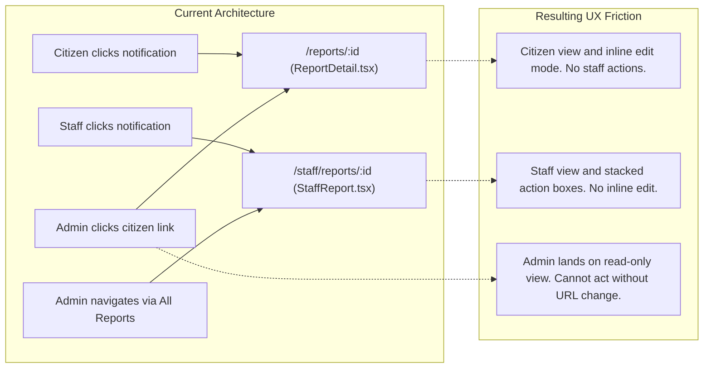
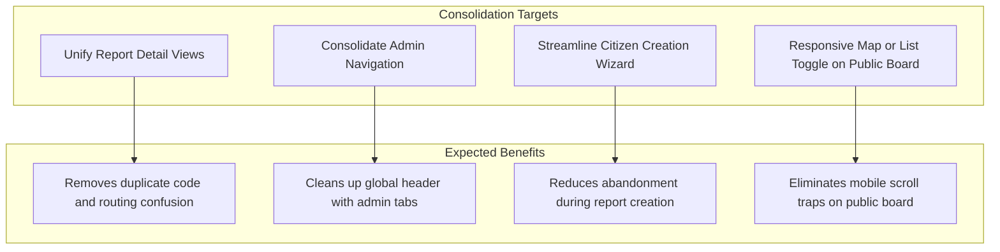

# KAMOTI: UI/UX Landscape, Consolidation & Strategic Directions

This document delivers a UI/UX audit of the KAMOTI platform. It identifies workflow friction points, component consolidation opportunities, and strategic directions to elevate user experience prior to demonstration and evaluation.

---

## 1. Design System Identity & Presentation Context

### The Modernist Aesthetic Foundation
KAMOTI implements a Modernist, Swiss-influenced design language defined in [`src/web/styles/app.css`](../src/web/styles/app.css) and [`src/web/styles/ds.css`](../src/web/styles/ds.css):
- **Typography:** Heavyweight Archivo (800 weight headings, letter-spacing -0.015em) paired with monospace metadata tags.
- **Zero Radius:** Strict ban on rounded corners (`--radius-sm: 0px`, `--radius-md: 0px`, `--radius-lg: 0px`).
- **Industrial Contrast:** Light neutral backgrounds (`#f3f2f2`, `#eae9e9`), stark charcoal text (`#201e1d`), heavy 2px rule borders, and a safety-orange accent (`#ec3013`).

### Evaluator & Presentation Perspective
When grading or critiquing civic municipal software, evaluators focus on:
1. **Frictionless Citizen Reporting:** How quickly can a resident in distress or on the street submit an issue with minimal cognitive effort?
2. **Operational Clarity for Staff:** Does the staff workspace make the next field action obvious, or does it require navigating nested menus?
3. **Visual Hierarchy & Information Density:** Is the screen cluttered with raw database fields, or is critical operational context prioritized?
4. **Mobile Viability:** Civic reporting happens on smartphones at the physical site of damage. Desktop-only paradigms degrade presentation credibility.

---

## 2. Screen-by-Screen UI/UX Findings & Friction Points

### A. Navigation Shell and Header ([`Layout.tsx`](../src/web/components/Layout.tsx))

| Finding / Area | Current Implementation | User Experience Friction |
| :--- | :--- | :--- |
| **Top Navigation Crowding** | All role routes are rendered as flat links in the header. For Admins, this renders 6 separate links (`Community board`, `Dashboard`, `Reports`, `Users`, `Categories`, `Activity`). | On tablet or medium screens, the navigation wraps onto multiple lines or collapses abruptly into the mobile menu. |
| **User Identity & Role Indicator** | Displays a plain text label (`{user.name} · {user.role}`) beside the sign out button. | Lacks visual weight; users cannot easily verify their active permissions or switch context at a glance. |
| **Mobile Drawer Ergonomics** | Toggle opens a vertical list that pushes the main page content downward rather than an overlay sheet. | Shifts page layout and disorients users on mobile viewports. |

---

### B. Public Transparency Board ([`Board.tsx`](../src/web/pages/Board.tsx))

| Finding / Area | Current Implementation | User Experience Friction |
| :--- | :--- | :--- |
| **Dual-Pane Viewport Balance** | Split 50/50 between Leaflet Map (top on mobile, left on desktop) and Report List. | On mobile screens, the map consumes 320px of vertical space, leaving less than one visible report card below the fold without extensive scrolling. |
| **Interactive Card Expansion** | Clicking a report card in the list expands its full description, address, and photo inline inside the `<button>` element. | Expanding a card with a large photo shifts list scroll position, pushing sibling cards off screen. |
| **Map View Sync Discoverability** | The checkbox "Only show reports in this map view" is tucked into a subtle subheader above the cards. | Users who pan or zoom the map expect the list to filter automatically, or may not realize the toggle exists. |

---

### C. Citizen Report Creation Wizard ([`NewReport.tsx`](../src/web/pages/NewReport.tsx))

| Finding / Area | Current Implementation | User Experience Friction |
| :--- | :--- | :--- |
| **Linear Step Isolation** | 3-step sequential wizard (`01: Where is it?`, `02: What is wrong?`, `03: Show us`). | Citizens cannot jump back and forth directly via breadcrumbs; they must repeatedly click Back and Continue. |
| **Address Geocoding Dependency** | Nominatim reverse-geocoding triggers on pin drop with a 1-second debounce. | If geocoding fails or lags on slow mobile connections, the address field remains blank without explicit feedback explaining that coordinates are already saved. |
| **Review Step Completeness** | Step 3 "Check before sending" only summarizes Category, Title, and Location. | It omits the description text and photo thumbnail from the pre-flight summary, forcing the citizen to go back to verify details. |

---

### D. The Dual Report Detail Disconnect (Citizen vs. Staff)

The application maintains two separate detail screens for the exact same underlying report entity:
- [`ReportDetail.tsx`](../src/web/pages/ReportDetail.tsx) (`/reports/:id`)
- [`StaffReport.tsx`](../src/web/pages/StaffReport.tsx) (`/staff/reports/:id`)

#### Structural Comparison: [`ReportDetail.tsx`](../src/web/pages/ReportDetail.tsx) vs [`StaffReport.tsx`](../src/web/pages/StaffReport.tsx)

| Feature / Element | Citizen Detail (`/reports/:id`) | Staff Detail (`/staff/reports/:id`) |
| :--- | :--- | :--- |
| **Layout** | 2-column: Metadata + Evidence on Left; Map + Timeline on Right. | 2-column: Metadata + Contact on Left; 3 Stacked Action Forms on Right. |
| **Reporter Contact Details** | Hidden (preserves privacy). | Visible (Name, Email, Phone number). |
| **History Display** | Full chronological timeline with vertical accent line. | Unstyled flat list of updates. |
| **Action Capability** | Inline edit form (only when `pending`). | Advance status form, remark form, photo resolution form. |
| **Admin Access State** | View only (action forms missing). | Full administrative update capability. |

---

### E. Staff Work Queue ([`StaffQueue.tsx`](../src/web/pages/StaffQueue.tsx))

| Finding / Area | Current Implementation | User Experience Friction |
| :--- | :--- | :--- |
| **Table-First Layout** | Dense HTML table showing Reference, Title, Category, Status, Filed date, and Action button. | On mobile screens, table requires horizontal scrolling. Field workers holding a phone on site struggle to tap row-level buttons. |
| **Single Action Direct Link** | Action button directly reflects the single legal next status (e.g., "Start review", "Begin work"). | While technically elegant, the button text does not immediately communicate that clicking it opens the report detail screen rather than immediately executing the transition. |

---

### F. Administrator Sub-System Fragmentation

The Administrator experience spans five distinct routes:
1. [`/admin`](../src/web/pages/AdminDashboard.tsx): Analytics Dashboard
2. [`/admin/reports`](../src/web/pages/AdminReports.tsx): All Reports & Assignment
3. [`/admin/users`](../src/web/pages/AdminUsers.tsx): User Provisioning & Roles
4. [`/admin/categories`](../src/web/pages/AdminCategories.tsx): Category Setup
5. [`/admin/logs`](../src/web/pages/AdminLogs.tsx): Activity Audit Trail

#### The Friction
There is no unified Admin Sub-Navigation bar. When an administrator navigates to `/admin/users`, the only way to return to `/admin/reports` is to reach back up into the top global site header.

---

## 3. Consolidation and Pruning Analysis

To make the application significantly cleaner, more maintainable, and impressive during presentations, the team can consider the following consolidation targets:

### High-Impact Consolidation Opportunities

| Target Component / Screen | Current Redundancy | Proposed Consolidation Model | Complexity Impact |
| :--- | :--- | :--- | :--- |
| **Report Detail Unification** | Separate [`ReportDetail.tsx`](../src/web/pages/ReportDetail.tsx) and [`StaffReport.tsx`](../src/web/pages/StaffReport.tsx). | Single `/reports/:id` view that conditionally renders an **Action Rail** if the user is assigned staff or admin, and an **Edit Drawer/Modal** if the user is the owning citizen with a pending report. | Medium (Reduces codebase by ~350 lines; unifies navigation). |
| **Admin Sub-Navigation** | 5 separate top-nav links in [`Layout.tsx`](../src/web/components/Layout.tsx). | A single `Admin` link in top nav leading to an internal Admin Shell with secondary tab navigation (`Analytics`, `Reports`, `Users`, `Categories`, `Audit`). | Low (Dramatically declutters top header for all viewports). |
| **Photo Upload & Framing** | Dual photo rendering logic across cards, details, and proof sections. | Standardized responsive photo gallery component with built-in modal lightbox for full-resolution inspection. | Low (Improves inspection experience for damage and repair proof). |
| **Mobile Board Viewport** | Stacked 320px map on top of card list on mobile. | Mobile segmented view toggle (`Map View` \| `List View`) or floating bottom sheet for cards over the map. | Medium (Transforms mobile experience from clunky to native-feeling). |

---

## 4. Strategic Directions for UI/UX Prioritization

These non-prescriptive directions represent options the team can choose from depending on presentation criteria.

### Direction 1: The "Executive Presentation Polish" Track
*Focus: Maximum visual impressiveness, clear storytelling, and polished interactions for reviewers.*
- **Unified Admin Command Center:** Add an admin secondary navigation tab bar across all `/admin/*` views with breadcrumbs and live metric badges (e.g., number of pending triage reports).
- **Interactive Full-Resolution Lightbox:** Allow evaluators to click evidence photos and proof of repair photos to view high-resolution zoomable modals with side-by-side Before/After comparison.
- **Micro-Interaction Feedback:** Enhance status progression with immediate optimistic visual updates and clear milestone celebration (e.g., distinct banner when a report reaches `resolved`).

### Direction 2: The "Mobile Citizen First" Track
*Focus: Seamless public reporting, mobile usability, and field testing credibility.*
- **Compact Stepper / Accordion Wizard:** Convert [`NewReport.tsx`](../src/web/pages/NewReport.tsx) into an accordion or progress stepper that allows jumping directly between location, problem details, and photos.
- **Mobile Map-Sheet Pattern on Public Board:** Replace the stacked 320px static map on mobile with an interactive full-screen map featuring a swipeable or toggleable bottom drawer for report cards.
- **Quick Location Pin Feedback:** Add a clear pulsating pin marker on the map picker indicating high-accuracy GPS lock.

### Direction 3: The "Operational Field Worker" Track
*Focus: Streamlining daily workflows for city engineers and field maintenance staff.*
- **Single Adaptive Report Workspace:** Merge [`ReportDetail.tsx`](../src/web/pages/ReportDetail.tsx) and [`StaffReport.tsx`](../src/web/pages/StaffReport.tsx). Both staff and citizens visit `/reports/:id`, with contextual action sidebars appearing only for authorized roles.
- **Card-Based Mobile Queue:** On [`StaffQueue.tsx`](../src/web/pages/StaffQueue.tsx), replace the wide horizontal table on mobile screens with responsive task cards optimized for one-thumb field interaction.
- **Direct Citizen Dial / SMS Action:** Format the citizen contact number on staff views with `tel:` and `sms:` URI links for one-tap field communication.
